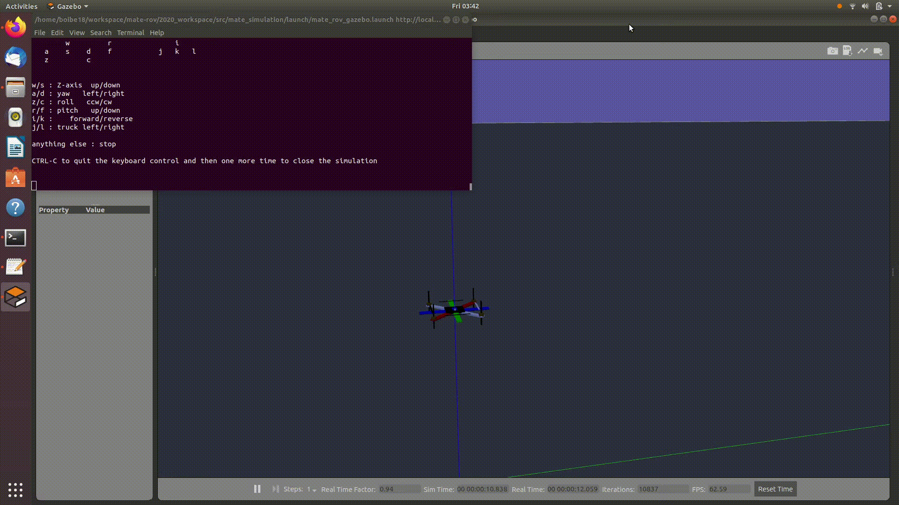

# MATE ROV Simulation

🚧 WARNING: this repo is under construction. 🚧

Welcome to the MATE simulation repository, developed by Columbia University Robotics Club. This repo contains the source code for simulating our underwater vehicle using ROS and Gazebo. 

## Getting Started

To start using our simulation system, you can follow the instructions provided in this [document](./GET_STARTED.md). 

For any questions, comments, or concerns, please don't hesitate to reach out to us at [curc@columbia.edu](mailto:curc@columbia.edu). If you are a current member of CURC and would like to contribute to the repository, please reach out to Jonathan or Neil via email or Slack. 

## About Us
We are the Columbia University Robotics Club, a student-run organization that develops robots and autonomous systems, both in a competitive and research setting. MATE ROV is an annual underwater vehicle challenge that we participate in. To learn more about our club, please visit [columbiaroboticsclub.com](https://www.columbiaroboticsclub.com)